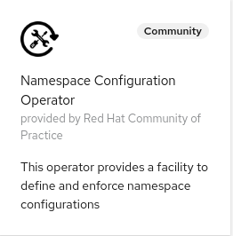

# Namespace Configuration Operator


[](https://goreportcard.com/report/github.com/redhat-cop/namespace-configuration-operator)


## Introduction

The `namespace-configuration-operator` helps keeping configurations related to Users, Groups and Namespaces aligned with one of more policies specified as a CRs. The purpose is to provide the foundational building block to create an end-to-end onboarding process.
By onboarding process we mean all the provisioning steps needed to a developer team working on one or more applications to OpenShift.
This usually involves configuring resources such as: Groups, RoleBindings, Namespaces, ResourceQuotas, NetworkPolicies, EgressNetworkPolicies, etc.... . Depending on the specific environment the list could continue.
Naturally such a process should be as automatic and scalable as possible.

With the namespace-configuration-operator one can create rules that will react to the creation of Users, Groups and Namespace and will create and enforce a set of resources.

Here are some examples of the type of onboarding processes that one could support:

1. [developer sandbox](./examples/user-sandbox/readme.md)
2. [team onboarding](./examples/team-onboarding/readme.md) with support of the entire SDLC in a multitentant environment.

Policies can be expressed with the following CRDs:

| Watched Resource | CRD |
|--|--|
| Groups | [GroupConfig](#GroupConfig) |
| Users | [UserConfig](#UserConfig) |
| Namespace | [NamespaceConfig](#NamespaceConfig) |

These CRDs all share some commonalities:

1. [Templated Resources](#Templated-Resources)
2. [List of ignored json paths](#Excluded-Paths)

### Templated Resources

Each has a parameter called `templatedResources`, which is an array. Each element of the array has two fields `objectTemplate` and `excludedPaths` (see below).

The `objectTemplate` field must contain a [go template](https://golang.org/pkg/text/template/) that resolves to a single API Resource expressed in `yaml`. The template is merged with the object selected by the CR. For example:

```yaml
apiVersion: redhatcop.redhat.io/v1alpha1
kind: UserConfig
metadata:
  name: test-user-config
spec:
  provider: corp-ldap
  templates:
  - objectTemplate: |
      apiVersion: v1
      kind: Namespace
      metadata:
        name: {{ .Name }}-sandbox
```

This creates a rule in which every time a user from the `corp-ldap` provider is created, a namespace called `<username>-sandbox` is also created.

More advanced templating functions found in the popular k8s management tool [Helm](https://helm.sh/) is also available. These functions are further described in the Helm [templating](https://helm.sh/docs/chart_template_guide/function_list/#kubernetes-and-chart-functions) documentation.

Additionally, there are functions not listed within the Helm documentation that are also available outlined in the table below.

| Function  |  Description |
|---------|---------|
| toYaml | takes an interface, marshals it to yaml, and returns a string. |
| fromYaml | converts a YAML document into a map[string]interface{}. |
| fromYamlArray | converts a YAML array into a []interface{}. |
| toToml  | takes an interface, marshals it to toml, and returns a string.|
| toJson | takes an interface, marshals it to json, and returns a string. |
| fromJson  | converts a JSON document into a map[string]interface{}. |
| fromJsonArray | converts a JSON array into a []interface{}. |

An example below of the `lookup`, `toJson`, `b64env`, `required`, and `lower` functions included in the expanded advanced templating functionality.

```golang
templates:
- objectTemplate: |
    - apiVersion: v1
      kind: Namespace
      metadata:
        annotations:
          parentOperatorCreatedOn: '{{ (lookup "v1" "Namespace" "" "namespace-configuration-operator").metadata.creationTimestamp }}'
          sourceTemplate: "{{ toJson . | b64enc }}"
          url: '{{ required "URL annotation on the Group is required!" .Annotations.url }}'
        name: {{ .Name | lower }}
```

For more examples on templates within Helm charts see this Helm [tips and tricks](https://helm.sh/docs/howto/charts_tips_and_tricks/) templating guide.

### Excluded Paths

The logic of the `namespace-configuration-operator` is to enforce that the resources resolved by processing the templates "stays in place". In other words if those resources are changed and/or deleted they will be reset by the operator.
But there are situations in which at least part of a resource is allowed to change. Common use cases are: annotations and in general the metadata section of a resource can be updated by the various operators watching that resources. The status field is often updated by the main operator managing that resources. Finally, when applicable the `spec.replicas` field should also be allowed to change.

To handle special use case, one can also specify additional *jsonpaths* that should be ignored when comparing the desired resource and the current resource and making a decision on whether that resource should be reset.

The following paths are always included:

1. `.metadata`
2. `.status`
3. `.spec.replicas`

## NamespaceConfig

The `NamespaceConfig` CR allows specifying one or more objects that will be created in the selected namespaces.

Namespaces can be selected by labels or annotations via a label selector for example:

```yaml
apiVersion: redhatcop.redhat.io/v1alpha1
kind: NamespaceConfig
metadata:
  name: small-namespace
spec:
  labelSelector:
    matchLabels:
      size: small  
  templates:
  - objectTemplate: |
      apiVersion: v1
      kind: ResourceQuota
      metadata:
        name: small-size
        namespace: {{ .Name }}
      spec:
        hard:
          requests.cpu: "4"
          requests.memory: "2Gi"
```

Here is a `NamespaceConfig` object using a `matchExpressions` selector:

```yaml
apiVersion: redhatcop.redhat.io/v1alpha1
kind: NamespaceConfig
metadata:
  name: tier-config
spec:
  annotationSelector:
    matchExpressions:
      - {key: tier, operator: In, values: [gold,silver]}
```

Although not enforced by the operator the general expectation is that the NamespaceConfig CR will be used to create objects inside the selected namespace.

The `default` namespace and all namespaces starting with either `kube-` or `openshift-` are never considered by this operator by default. This is a safety feature to ensure that this operator does not interfere with the core of the system. You can override this behavior by setting the `ALLOW_SYSTEM_NAMESPACES` environment variable to true.

Examples of NamespaceConfig usages can be found [here](./examples/namespace-config/readme.md)

## GroupConfig

The `GroupConfig` CR allows specifying one or more objects that will be created in the selected Group.
Groups can be selected by labels or annotations via a label selector, similarly to the `NamespaceConfig`.

Often groups are created in OpenShift by a job that synchronizes an Identity Provider with OCP. So the idea is that when new groups are added or deleted the configuration in OpenShift will adapt automatically.

Although not enforced by the operator, GroupConfig are expected to create cluster-scoped resources like Namespaces, ClusterResourceQuotas and potentially some namespaced resources like RoleBindings.

## UserConfig

In OpenShift an external user is defined by two entities: Users and Identities. There is a relationship of one to many between Users and Identities. Given one user, there can be one Identity per authentication mechanism.

The `UserConfig` CR allows specifying one or more objects that will be created in the selected User.
Users can be selected by label or annotation like `NamespaceConfig` and `UserConfig`.
Users can also be selected by provider name (the name of the authentication mechanism) and identity extra field.

Here is an example:

```yaml
apiVersion: redhatcop.redhat.io/v1alpha1
kind: UserConfig
metadata:
  name: test-user-config
spec:
  providerName: okta-provider
  identityExtraFieldSelector:
    matchLabels:
      sandbox_enabled: "true"
  templates:
  - objectTemplate: |
      apiVersion: v1
      kind: Namespace
      metadata:
        name: {{ .Name }}-sandbox
```

User will be selected by this `UserConfig` only if they login via the *okta-provider* and if the extra field was populate with the label `sandbox_enabled: "true"`. Note that not all authentication provider allow populating the extra fields in the Identity object.

## Deploying the Operator

This is a cluster-level operator that you can deploy in any namespace, `namespace-configuration-operator` is recommended.

It is recommended to deploy this operator via [`OperatorHub`](https://operatorhub.io/), but you can also deploy it using [`Helm`](https://helm.sh/).

### Deploying from OperatorHub

If you want to utilize the Operator Lifecycle Manager (OLM) to install this operator, you can do so in two ways: from the UI or the CLI.

#### Deploying from OperatorHub UI

* If you would like to launch this operator from the UI, you'll need to navigate to the OperatorHub tab in the console.Before starting, make sure you've created the namespace that you want to install this operator to with the following:

```shell
oc new-project namespace-configuration-operator
```

* Once there, you can search for this operator by name: `namespace configuration`. This will then return an item for our operator and you can select it to get started. Once you've arrived here, you'll be presented with an option to install, which will begin the process.
* After clicking the install button, you can then select the namespace that you would like to install this to as well as the installation strategy you would like to proceed with (`Automatic` or `Manual`).
* Once you've made your selection, you can select `Subscribe` and the installation will begin. After a few moments you can go ahead and check your namespace and you should see the operator running.



#### Deploying from OperatorHub using CLI

If you'd like to launch this operator from the command line, you can use the manifests contained in this repository by running the following:

```shell
oc new-project namespace-configuration-operator
oc apply -f config/operatorhub -n namespace-configuration-operator
```

This will create the appropriate OperatorGroup and Subscription and will trigger OLM to launch the operator in the specified namespace.

You can set `ALLOW_SYSTEM_NAMESPACES` environment variable in `Subscription` like this;
```
apiVersion: operators.coreos.com/v1alpha1
kind: Subscription
metadata:
  name: namespace-configuration-operator
spec:
  channel: alpha
  config:
    env:
    - name: ALLOW_SYSTEM_NAMESPACES
      value: true
  installPlanApproval: Automatic
  name: namespace-configuration-operator
  source: community-operators
  sourceNamespace: openshift-marketplace
```

### Deploying with Helm

Here are the instructions to install the latest release with Helm.

```shell
oc new-project namespace-configuration-operator
helm repo add namespace-configuration-operator https://redhat-cop.github.io/namespace-configuration-operator
helm repo update
helm install namespace-configuration-operator namespace-configuration-operator/namespace-configuration-operator
```

This can later be updated with the following commands:

```shell
helm repo update
helm upgrade namespace-configuration-operator namespace-configuration-operator/namespace-configuration-operator
```

## Metrics

Prometheus compatible metrics are exposed by the Operator and can be integrated into OpenShift's default cluster monitoring. To enable OpenShift cluster monitoring, label the namespace the operator is deployed in with the label `openshift.io/cluster-monitoring="true"`.

```shell
oc label namespace <namespace> openshift.io/cluster-monitoring="true"
```

### Testing metrics

```sh
export operatorNamespace=namespace-configuration-operator-local # or namespace-configuration-operator
oc label namespace ${operatorNamespace} openshift.io/cluster-monitoring="true"
oc rsh -n openshift-monitoring -c prometheus prometheus-k8s-0 /bin/bash
export operatorNamespace=namespace-configuration-operator-local # or namespace-configuration-operator
curl -v -s -k -H "Authorization: Bearer $(cat /var/run/secrets/kubernetes.io/serviceaccount/token)" https://namespace-configuration-operator-controller-manager-metrics.${operatorNamespace}.svc.cluster.local:8443/metrics
exit
```

## Development

### Running the operator locally

```shell
make install
oc new-project namespace-configuration-operator-local
kustomize build ./config/local-development | oc apply -f - -n namespace-configuration-operator-local
export token=$(oc serviceaccounts get-token 'namespace-configuration-controller-manager' -n namespace-configuration-operator-local)
oc login --token ${token}
make run ENABLE_WEBHOOKS=false
```

### Test helm chart locally

Define an image and tag. For example...

```shell
export imageRepository="quay.io/redhat-cop/namespace-configuration-operator"
export imageTag="$(git -c 'versionsort.suffix=-' ls-remote --exit-code --refs --sort='version:refname' --tags https://github.com/redhat-cop/namespace-configuration-operator.git '*.*.*' | tail --lines=1 | cut --delimiter='/' --fields=3)"
```

Deploy chart...

```shell
make helmchart IMG=${imageRepository} VERSION=${imageTag}
helm upgrade -i namespace-configuration-operator-local charts/namespace-configuration-operator -n namespace-configuration-operator-local --create-namespace
```

Delete...

```shell
helm delete namespace-configuration-operator-local -n namespace-configuration-operator-local
kubectl delete -f charts/namespace-configuration-operator/crds/crds.yaml
```

### Building/Pushing the operator image

```shell
export repo=raffaelespazzoli #replace with yours
docker login quay.io/$repo/namespace-configuration-operator
make docker-build IMG=quay.io/$repo/namespace-configuration-operator:latest
make docker-push IMG=quay.io/$repo/namespace-configuration-operator:latest
```

### Deploy to OLM via bundle

```shell
make manifests
make bundle IMG=quay.io/$repo/namespace-configuration-operator:latest
operator-sdk bundle validate ./bundle --select-optional name=operatorhub
make bundle-build BUNDLE_IMG=quay.io/$repo/namespace-configuration-operator-bundle:latest
docker login quay.io/$repo/namespace-configuration-operator-bundle
docker push quay.io/$repo/namespace-configuration-operator-bundle:latest
operator-sdk bundle validate quay.io/$repo/namespace-configuration-operator-bundle:latest --select-optional name=operatorhub
oc new-project namespace-configuration-operator
operator-sdk cleanup namespace-configuration-operator -n namespace-configuration-operator
operator-sdk run bundle --install-mode AllNamespaces -n namespace-configuration-operator quay.io/$repo/namespace-configuration-operator-bundle:latest
```

### Testing

#### Testing NamespaceConfig

```shell
oc apply -f ./test/namespace-config-test.yaml
oc apply -f ./test/namespaces.yaml
```

#### Testing GroupConfig

```shell
oc apply -f ./test/group-config-test.yaml
oc apply -f ./test/groups.yaml
```

#### Testing UserConfig

```shell
oc apply -f ./test/user-config-test.yaml
oc apply -f ./test/users.yaml
for username in test-user-config test-user-config2 ; do
export username
export uid=$(oc get user $username -o jsonpath='{.metadata.uid}')
cat ./test/identities.yaml | envsubst | oc apply -f -
done
```

### Releasing

```shell
git tag -a "<tagname>" -m "<commit message>"
git push upstream <tagname>
```

If you need to remove a release:

```shell
git tag -d <tagname>
git push upstream --delete <tagname>
```

If you need to "move" a release to the current main

```shell
git tag -f <tagname>
git push upstream -f <tagname>
```

### Cleaning up

```shell
operator-sdk cleanup namespace-configuration-operator -n namespace-configuration-operator
oc delete operatorgroup operator-sdk-og
oc delete catalogsource namespace-configuration-operator-catalog
```
